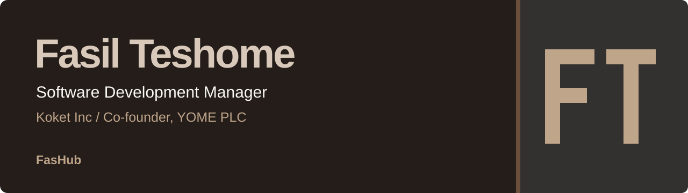
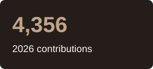
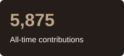
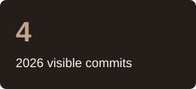
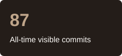

<picture>
  <source media="(max-width: 600px)" srcset="./assets/profile-banner-mobile.svg" />
  
</picture>

I'm **Fasil Teshome**, Software Development Manager at **Koket Inc** and co-founder of **YOME PLC**, based in Addis Ababa, Ethiopia. Previously, I worked at **INSA**.

I'm a **Software Engineering graduate of Mekelle University**. Most of my professional work is in private repositories.

[LinkedIn](https://www.linkedin.com/in/fasil-teshome/) · [Telegram](https://t.me/fashub21)

<h2>
  <picture>
    <source media="(prefers-color-scheme: dark)" srcset="./assets/heading-engineering-dark.svg" />
    
  </picture>
</h2>

I'm an **AI engineer** with a background in full-stack web and mobile development, from **Flutter** apps and **React** interfaces to **Node.js** and **NestJS** services and APIs.

- **Mobile:** Flutter, Dart, BLoC and RxDart
- **Web:** React, JavaScript, HTML, CSS and Tailwind CSS
- **Backend:** Node.js, NestJS, Express, REST APIs and MongoDB
- **Tools & interests:** Docker, Git, electronics and hardware tinkering

<h2>
  <picture>
    <source media="(prefers-color-scheme: dark)" srcset="./assets/heading-activity-dark.svg" />
    
  </picture>
</h2>

<!-- profile-stats:start -->

  
  
  
  

**36 public repositories** · **35 stars earned**

Contributions include publicly shared private activity. Commit totals cover contribution-eligible commits visible to the updater; private contributions are not counted as commits. All-time totals span the contribution years GitHub reports.
<!-- profile-stats:end -->

<h2>
  <picture>
    <source media="(prefers-color-scheme: dark)" srcset="./assets/heading-connect-dark.svg" />
    
  </picture>
</h2>

For engineering leadership, product development or technical collaboration, connect with me on [LinkedIn](https://www.linkedin.com/in/fasil-teshome/) or [Telegram](https://t.me/fashub21).
